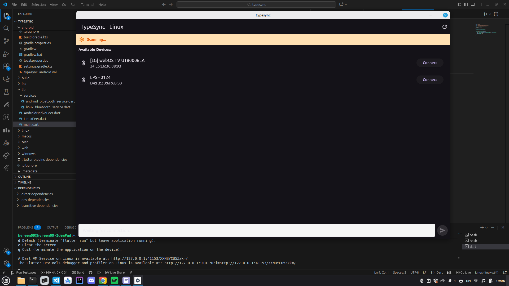

# TypeSync 📱💻

**TypeSync** is a seamless Bluetooth Low Energy (BLE) chat application that bridges the gap between **Android** and **Linux**. It allows for real-time text synchronization and clipboard sharing without requiring an internet connection.



## Key Highlights

This project features a hybrid architecture to maximize performance and compatibility:

### **Native Android Implementation (Server)**
**I personally designed and wrote the entire Android BLE Server layer in native Kotlin.** 
Instead of relying on standard Flutter plugins which often lack advanced peripheral features, I implemented a robust `BluetoothGattServer` directly in the Android embedding.

*   **Custom GATT Server**: Built from scratch using Android's `android.bluetooth` APIs.
*   **Advanced Advertising**: Implements split advertising packets (UUID + Name) to bypass data size limits.
*   **Stability**: Handles complex states like `BluetoothGattDescriptor` management and CCCD (Client Characteristic Configuration Descriptor) logic manually to ensure compatibility with Linux BlueZ stacks.
*   **Method Channels**: A custom bridge connects the high-performance native Kotlin layer with the Flutter UI.

### **Linux Implementation (Client)**
The Linux client is built using Flutter and `flutter_blue_plus`, optimized to handle the specific quirks of the Linux Bluetooth stack (BlueZ).

*   **Smart Scanning**: Filters devices by Service UUID to instantly find the TypeSync server.
*   **Manual Connection Control**: Full control over scanning, connecting, and pairing.
*   **BlueZ Workarounds**: Includes specific logic to handle BlueZ caching issues and bonding requirements.

---

## Features

*   **Offline Communication**: Works entirely over Bluetooth Low Energy. No Wi-Fi or Data needed.
*   **Cross-Platform**: Connects your Android phone to your Linux laptop.
*   **Real-Time Chat**: Instant message delivery with low latency.
*   **Clipboard Integration**: Long-press any message to copy it to your clipboard.
*   **Modern UI**: Clean, Material 3 design with platform-specific adaptations.

---

##  Getting Started

### Prerequisites
*   **Android Device**: Running Android 8.0 or higher.
*   **Linux Device**: With Bluetooth support and BlueZ installed.

### Installation

1.  **Clone the repository**:
    ```bash
    git clone https://github.com/yourusername/typesync.git
    cd typesync
    ```

2.  **Run on Android (Server)**:
    ```bash
    flutter run -d <android_device_id>
    ```
    *The app will automatically start the BLE Server and begin advertising.*

3.  **Run on Linux (Client)**:
    ```bash
    flutter run -d linux
    ```
    *Click the refresh button to scan, then select your phone to connect.*

---

##  Troubleshooting

*   **"Discovered 0 Services" on Linux**: This is usually a BlueZ caching issue. Unpair/Forget the device on both the phone and laptop, then try again.
*   **Connection Stuck**: Ensure the Android app is open and the status says "BLE Server Running".

---

## Feel free to contribute!!
